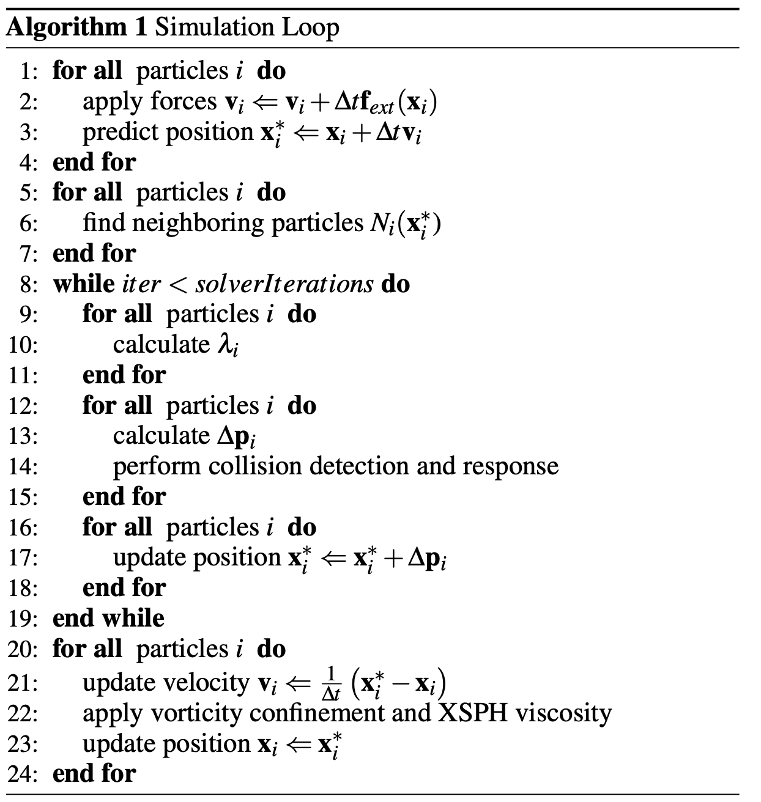

# Tiny_PBF

This project is a c++ version of Position Based Fluids.

OpenMP Parallization and cuda optimization will be used to accelarate the simulation.

## Introdution

Position Based Fluids (PBF) is a fluid simulation method using position based dynamics framework. We see the fluid consists of many small particles. For each step, we update all the particles in the constraints of constant density. The whole process can be summarized as the following psuedo code.

(image from the [original paper](https://mmacklin.com/pbf_sig_preprint.pdf))

## Method

The algorithm can be divided into 4 parts.

1. Calculate the force (1-4)

Basically, it is just the gravity force. We can use OpenMP and cuda to do it in parallel.

2. Find the neighbourhood (5-7)

Uniform grids are used to store all the particles. For each particle, the neighbor particles are all the ones in the neighboring 3x3 grids.

Particles are stored in a fixed-length 1-D array and each grid is defined by its start index and end index. In this way we can get rid of dynamic allocation of memory.

We can use multi-thread to accelarate this process.

3. Calculate the position change in the constraints and update the position (9-18)

This process can be accelarate in the same way as step 1.

4. Do a few iterations to make it stable.

## Results

(in progress)
